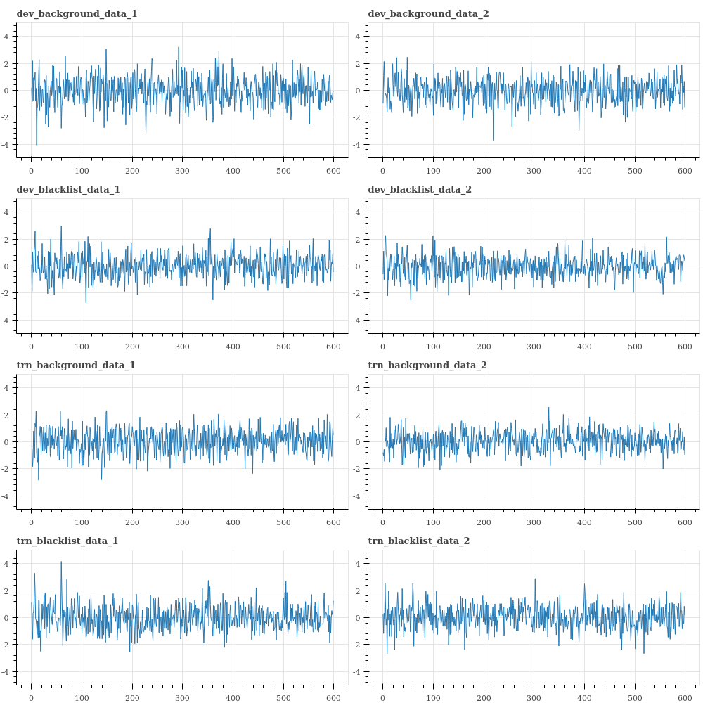

# MCE
## Multi-target speaker detection and identification Challenge Evaluation

This repository contains codes for MCE2018 competition. (Full version of the code will be uploaded after the competition ends.)

## Data Visualization

<h6>Data from the four files:</h6>

<h6>Mean of the ivector data:</h6>

<h6>Maximum of the ivector data:</h6>

<h6>Minimum of the ivector data:</h6>

